# BoardGameGeek Corpus creation (`bgg_corpus`)

This project builds a **structured corpus of BoardGameGeek (BGG) reviews**, integrating both metadata and user reviews from **crawler and API sources**, with support for **review preprocessing, balancing, and corpus assembly**.

---

## 1. Full Pipeline Overview

Created with mermaid code:

```mermaid
%%{init: {'theme':'base', 'themeVariables': { 'primaryColor':'#e3f2fd','primaryTextColor':'#000','primaryBorderColor':'#1976d2','lineColor':'#666','secondaryColor':'#fff3e0','tertiaryColor':'#e8f5e9'}}}%%
flowchart TD
    %% Enhanced Styles
    classDef phaseBox fill:#f3f6ff,stroke:#1976d2,stroke-width:2px,color:#000,font-weight:700;
    classDef action fill:#ffffff,stroke:#666,stroke-width:1.5px,color:#000,rx:5,ry:5;
    classDef data fill:#e3f2fd,stroke:#1976d2,stroke-width:1.5px,color:#000,shape:cylinder;
    classDef decision fill:#fff9c4,stroke:#f57c00,stroke-width:2px,color:#000,font-weight:700;
    classDef parallel fill:#c8e6c9,stroke:#2e7d32,stroke-width:2px,color:#000;
    classDef util fill:#fff3e0,stroke:#e65100,stroke-width:1.5px,color:#000;
    classDef endpoint fill:#e1bee7,stroke:#6a1b9a,stroke-width:2px,color:#000,font-weight:700;

    %% START
    START(["🎮 build_corpus(game_ids, source, balance_strategy, ...)"]):::endpoint

    START --> PHASE1

    %% ═══════════════════════════════════════════════════════════
    %% PHASE 1: Collection & Balancing
    %% ═══════════════════════════════════════════════════════════
    subgraph PHASE1[" 📥 PHASE 1: Collection & Balancing "]
        direction TB
        
        M1["🔄 merge_reviews(game_ids, source)<br/><i>Merge API + Crawler data</i>"]:::util
        
        CB1["⚖️ collect_balanced_reviews_multi_game()<br/>• Apply balance_strategy (over/under/hybrid)<br/>• min_samples per rating<br/>• Optional augmentation"]:::action
        
        SR1["📊 save_balance_report(stats)<br/><i>Store balancing statistics</i>"]:::action
        
        DATA1[("📦 collected_reviews<br/>(list of standardized review dicts)")]:::data
        
        M1 --> CB1
        CB1 -->|"reviews + stats"| DATA1
        CB1 -->|"stats"| SR1
        SR1 -.->|"report saved"| DATA1
    end

    %% ═══════════════════════════════════════════════════════════
    %% PHASE 2: Grouping & Preparation
    %% ═══════════════════════════════════════════════════════════
    subgraph PHASE2[" 🗂️ PHASE 2: Group & Prepare "]
        direction TB
        
        EO2["🔧 ensure_review_obj(r, gid)<br/><i>Standardize review format</i>"]:::util
        
        GB2["📋 Group by game_id<br/><i>defaultdict(list)</i>"]:::action
        
        DATA2[("🎲 game_groups<br/>{game_id: [reviews]}")]:::data
        
        EO2 --> GB2
        GB2 --> DATA2
    end

    DATA1 --> EO2

    %% ═══════════════════════════════════════════════════════════
    %% PHASE 3: Per-Game Processing
    %% ═══════════════════════════════════════════════════════════
    subgraph PHASE3[" 🔄 PHASE 3: Per-Game Processing (loop over game_ids) "]
        direction TB
        
        LOOP3["🔁 For each (game_id, reviews)"]:::phaseBox
        
        BM3["📊 build_metadata(game_id)<br/><i>Fetch game metadata</i>"]:::util
        
        IGC3["🎮 GameCorpus(game_id, metadata, documents=[])"]:::action
        
        DEC3{"🤔 Use parallel processing?<br/>(parallel=True & reviews>0)"}:::decision
        
        %% Parallel Branch
        subgraph PARALLEL[" ⚡ Parallel Processing "]
            direction TB
            PP3["🔀 ProcessPoolExecutor(max_workers)"]:::parallel
            SUB3["📤 Submit: process_single_review(review)<br/><i>for each review</i>"]:::parallel
            AC3["📥 as_completed(futures)<br/><i>Collect results</i>"]:::parallel
            ADD3P["➕ Add CorpusDocument to GameCorpus<br/><i>Set fileid, game_id</i>"]:::parallel
            
            PP3 --> SUB3 --> AC3 --> ADD3P
        end
        
        %% Sequential Branch
        subgraph SEQUENTIAL[" 🔄 Sequential Processing "]
            direction TB
            SEQ3["🔁 for review in reviews:<br/>process_single_review(review)"]:::action
            ADD3S["➕ Add CorpusDocument to GameCorpus<br/><i>Set fileid, game_id</i>"]:::action
            
            SEQ3 --> ADD3S
        end
        
        APPEND3["📝 games.append(game_corpus)"]:::action
        
        LOOP3 --> BM3 --> IGC3 --> DEC3
        DEC3 -->|"Yes"| PARALLEL
        DEC3 -->|"No"| SEQUENTIAL
        ADD3P --> APPEND3
        ADD3S --> APPEND3
    end

    DATA2 --> LOOP3
    
    %% ═══════════════════════════════════════════════════════════
    %% PHASE 4: Assembly & Return
    %% ═══════════════════════════════════════════════════════════
    subgraph PHASE4[" 📚 PHASE 4: Corpus Assembly & Return "]
        direction TB
        
        TOTAL4["🧮 Compute totals<br/><i>Games processed, documents count</i>"]:::action
        
        DATA4A[("🎲 games<br/>[GameCorpus objects]")]:::data
        
        FC4["🗄️ Corpus(games=games)"]:::action
        
        DATA4B[("📊 stats<br/>(balancing statistics)")]:::data
        
        SUM4["📋 Print summary<br/>• Games processed<br/>• Total documents"]:::action
        
        TOTAL4 --> DATA4A
        DATA4A --> FC4
        FC4 --> SUM4
        DATA4B -.-> SUM4
    end

    APPEND3 -.->|"after loop"| TOTAL4
    
    %% FINAL RETURN
    RETURN(["✅ Return (Corpus, stats)"]):::endpoint
    SUM4 --> RETURN

    %% ═══════════════════════════════════════════════════════════
    %% Legend
    %% ═══════════════════════════════════════════════════════════
    subgraph LEGEND[" 🏷️ LEGEND "]
        direction LR
        L1["⚙️ Action/Process"]:::action
        L2["📦 Data/Object"]:::data
        L3["❓ Decision Point"]:::decision
        L4["⚡ Parallel Pool"]:::parallel
        L5["🔧 Utility Function"]:::util
    end

    %% Global Styles
    style PHASE1 fill:#e3f2fd,stroke:#1976d2,stroke-width:2.5px,rx:10,ry:10
    style PHASE2 fill:#fff3e0,stroke:#e65100,stroke-width:2.5px,rx:10,ry:10
    style PHASE3 fill:#e8f5e9,stroke:#2e7d32,stroke-width:2.5px,rx:10,ry:10
    style PHASE4 fill:#f3e5f5,stroke:#6a1b9a,stroke-width:2.5px,rx:10,ry:10
    style PARALLEL fill:#c8e6c9,stroke:#1b5e20,stroke-width:2px,stroke-dasharray:5,rx:8,ry:8
    style SEQUENTIAL fill:#ffecb3,stroke:#e65100,stroke-width:2px,stroke-dasharray:5,rx:8,ry:8
    style LEGEND fill:#fafafa,stroke:#666,stroke-width:1px,rx:5,ry:5
```



---

## 2. Pipeline Summary

1. **Downloaders:** Extract raw reviews and metadata using the **crawler** or **API**.
2. **Utilities:** Merge reviews, load metadata, standardize text, and build corpus objects.
3. **Balancing:** Apply oversampling, undersampling, or hybrid strategies to handle rating imbalance.
4. **Preprocessing:** Clean, normalize, and label review text via `process_single_review()`.
5. **Corpus Assembly:** Construct hierarchical corpus objects ready for downstream analysis.

---

## 3. Modules Overview

## 3. Modules Overview

| Module                                         | Purpose                                                      | Documentation                     |
| ---------------------------------------------- | ------------------------------------------------------------ | --------------------------------- |
| **[downloaders](./downloaders/README.md)**     | Fetch reviews and metadata from BGG (crawler/API).           | [docs](./downloaders/README.md)   |
| **[utilities](./utilities/README.md)**         | Load/merge reviews, build metadata, and assemble corpus.     | [docs](./utilities/README.md)     |
| **[preprocessing](./preprocessing/README.md)** | Clean and normalize review text.                             | [docs](./preprocessing/README.md) |
| **[balancing](./balancing/README.md)**         | Balance review distribution by ratings.                      | [docs](./balancing/README.md)     |
| **[models](./models/README.md)**               | Define `Corpus`, `GameCorpus`, and `CorpusDocument` classes. | [docs](./models/README.md)        |
| **[features](./features/README.md)**           | Handle linguistic and vector representations.                | [docs](./features/README.md)      |
| **[storage](./storage/README.md)**             | Save and load corpora from MongoDB or disk.                  | [docs](./storage/README.md)       |

---

## 4. CLI Usage (`cli.py`)

```bash
# Build corpus for games 50, 51, 52 with default settings
python cli.py --games 50 51 52 --save-json --generate-stats

# Build corpus using hybrid balance, enable augmentation
python cli.py --games 50 51 52 --balance-strategy hybrid --use-augmentation

# Use API-only reviews and disable parallel processing
python cli.py --games 50 51 52 --source api --no-parallel
```

**Key Options:**

| Option                         | Description                                           |
| ------------------------------ | ----------------------------------------------------- |
| `--games`                      | List of BGG game IDs                                  |
| `--source`                     | `"crawler"`, `"api"`, or `"combined"`                 |
| `--balance-strategy`           | `"oversample"`, `"undersample"`, `"hybrid"`           |
| `--use-augmentation`           | Enable text augmentation for underrepresented ratings |
| `--save-json` / `--save-mongo` | Save corpus as JSON or MongoDB                        |
| `--generate-stats`             | Print corpus and balancing statistics                 |

---

## 5. Corpus Building Workflow

The `build_corpus()` function constructs the complete BGG review corpus in **four main phases**:

### **Phase 1 — Review Collection & Balancing**

- Merge API and crawler reviews with `merge_reviews()`.
- Apply `collect_balanced_reviews_multi_game()` to handle rating imbalances (oversample / undersample / hybrid).
- Optionally perform text augmentation.
- Save balancing reports via `save_balance_report()`.

### **Phase 2 — Grouping & Preparation**

- Standardize each review object with `ensure_review_obj()`.
- Group reviews by `game_id` into a structured dictionary for processing.

### **Phase 3 — Per-Game Processing**

- For each game:

  - Build metadata with `build_metadata()`.
  - Create a `GameCorpus` instance.
  - Convert reviews into `CorpusDocument` objects using `process_single_review()`.
  - Optionally parallelize processing with `ProcessPoolExecutor`.

### **Phase 4 — Assembly & Return**

- Aggregate all `GameCorpus` objects into a top-level `Corpus`.
- Compute total processed documents.
- Return the tuple `(Corpus, stats)`.

**Final Output Structure:**

```
Corpus
 ├─ GameCorpus (game_id)
 │   ├─ CorpusDocument (review)
 │   └─ ...
 └─ GameCorpus
 ...
```

---

## 6. Configuration (`config.py`)

Main configuration paths and constants

---

## 7. Example Python Usage

```python
from bgg_corpus.utilities import build_corpus

corpus, stats = build_corpus(
    game_ids=[50, 51, 52],
    source="combined",
    balance_strategy="hybrid",
    use_augmentation=True,
    parallel=True,
    max_workers=4
)

print(f"Total reviews processed: {sum(len(g.documents) for g in corpus.games)}")
```

---

## 8. Notes

- **Crawler** → Preferred for fine-grained review filtering (rated/commented/neutral).
- **API** → Best for fast large-scale metadata & review extraction.
- **Utilities** → Centralized helpers for merging, metadata, and preprocessing.
- **Preprocessing** → Ensures consistent, clean review text for analysis.
- **Balancing** → Addresses skewed rating distributions (e.g., few 1s or 10s, many 6s–7s).
- **Parallelism** → Accelerates review processing for large datasets.

